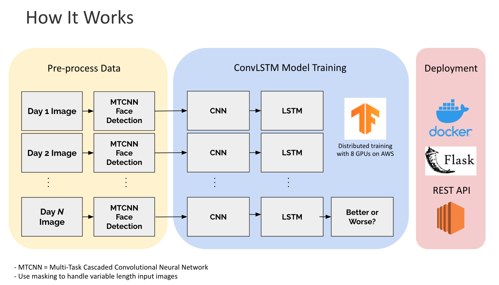
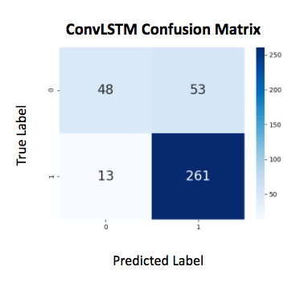

# SkinCredible
[Insight AI Fellowship Consulting Project] In collaboration with [CureSkin](https://cureskin.com/), SkinCredible leverages 
 deep learning to help dermatologists monitor facial skin conditions over time. Given a series of images taken at different 
 points in time by a user, the idea is to classify whether the user's facial skin condition has improved or deteriorated over time.
The model was previously deployed at skincredible.me. [Here](assets/demo.pdf) are the slides for the project SkinCredible.
 
 
 
 ## How It Works
SkinCredible uses a combination of Convolutional Neural Networks (CNNs) and Long Short-Term Memory networks (LSTMs) trained
 on a proprietary dataset provided by [CureSkin](https://cureskin.com/) to learn the representation of the spatiotemporal sequence of image dataset.
Images can be taken from different angles and orientations, so I apply a pre-processing step and use the pre-trained Multi-Task Cascaded Convolutional Neural Network (MTCNN) to extract
faces from the image sequence. Since ground truth labels are not available for this supervised learning problem, I came up with the idea to apply sentiment
 analysis with AWS Comprehend to dermatologists' notes to create proxy labels for training.
 

 
## Files 
`model`: Directory containing the ConvLSTM model
> `data_augment.py`: Create new images flipped horizontally to reduce the problem of unbalanced dataset

> `evaluate.py`: Output evaluataion metrics for validation/test dataset

> `face_detection.py`: Extract faces from images with MTCNNs

> `get_data.py`: Pre-process raw dataset stored in AWS S3 private bucket

> `network_architection`: Define the ConvLSTM model

> `opts.py`: Contain project arguments and hyperparameters

> `predict.py`: Output ConvLSTM predictions

> `split.py`: Split dataset into train, validation and test set

> `train.py`: Run distributed training of the model with multi-GPUs

> `utils.py`: Contain helper functions

`api`: Directory for the RESTful Web API with Flask

`tests`: Simple unit tests for the API

`data`: Directory containing anonymized dataset

## Results
The model achieves 82% accuracy and 83% precision. Keep in mind that the dataset is imbalanced,
with 70% postive samples and 30% negative samples. The figure below shows a confusion matrix summarizing the outputs of the trained model.

## Training Pipeline
1. Run `get_data.py`, which reads user data from `followup_data` directory if the user contains doctor's notes, as indicated by
`dr_msg_stats.csv`. This script also uses AWS Comprehend to detect the primary language and sentiment of the doctor's notes for each user.
After running this script, `user_data.txt` will be generated, where each line is a list containing user id, proxy label, dr_notes, and image paths associated with the user id sorted by time created.
Note that the latest doctor note is the one used as a proxy label for the ground truth label. 
1. Run `face_detection.py`, which extract faces from the images. It uses the pre-trained MTCNN algorithm to generate faces with size (160, 160). The resized images are then uploaded to 
an AWS S3 bucket for training later.
1. (Optional) Depending on how unbalanced the dataset is, run `data_augment.py`, which adds new negative samples
by flipping the images horizontally. Positive means skin conditions have improved, and negative means
skin condition has deteriorated.
1. Run `split.py`, which reads in `user_data.txt` and splits the dataset into train, validation, and test set.
1. Run `train.py` to train the ConvLSTM model. It will automatically train the model with multiple GPUs if available.

## Model Architecture
1. The model is built using Keras Functional API with two inputs and one output.
1. The first input is a batch of a sequence of image with size (batch_size, frame_size, image_size, image_size, channel_size), where the default
is of size (8, 30, 80, 80, 3).
1. The second input is a masking array of size (batch_size, frame_size), which is a binary array 
that tells the ConvLSTM layer to accept or ignore the image at the time step. This is done so 
that the model generalizes well to variable length image sequence.
1. During inference, the model can take in input with variable frame size and image size. Note that
if the inference input image size is smaller than the training image size, the images will be enlarged to the training
image size, which will affect the performance of the trained model.

## API Deployment
1. Build a Docker image by running `docker build -t skincredible .`
1. Deploy the web app and API by running `docker run -p 80:80 -v ${HOME}/.aws/credentials:/root/.aws/credentials:ro skincredible`, assuming
that you have the right AWS credentials to import the model weights stored in AWS.
1. If deploying locally, simply call `curl -X POST 0.0.0.0:5000/predict -H 'Content-Type: application/json' -d @data/test_data.json`, which
will respond back with the probabilites of a user having facial skin conditions improvement or deterioration. Change the IP address and port number if deploying on the cloud.
The input is `test_data.json`, which contains a numpy array with size (1, frame_size, img_size, img_size, channel_size).

 
 
  
 
 